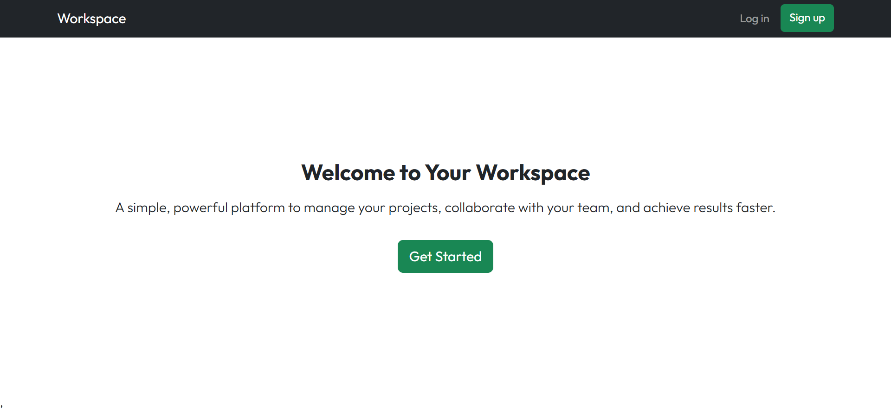
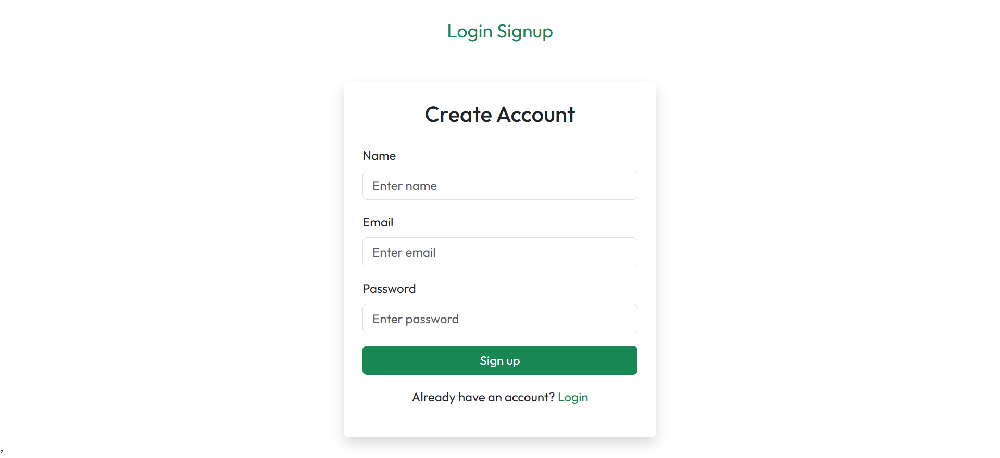
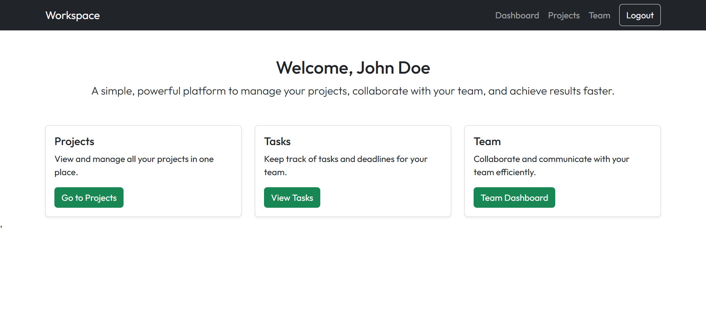
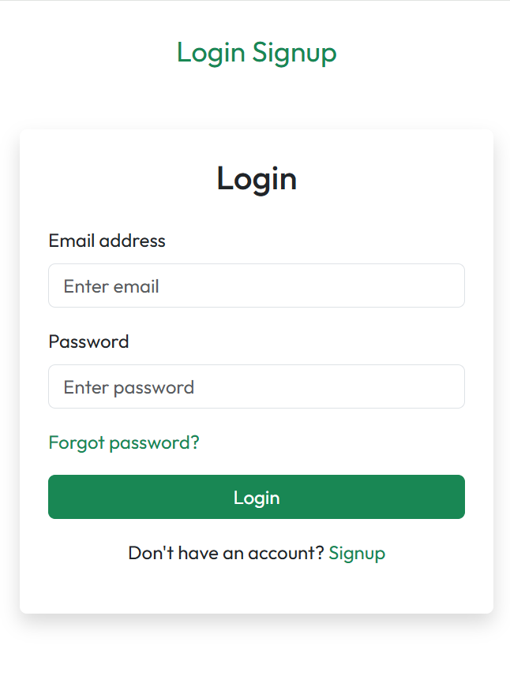

# 🔐 MERN Authentication System

<table>
  <tr>
    <td></td>
    <td></td>
  </tr>
  <tr>
    <td></td>
    <td></td>
  </tr>
</table>

A **full-stack MERN authentication project** with secure JWT-based authentication, email verification, password management, and cookie-based sessions. Built using modern tools like **Vite**, **Bootstrap**, **React Toastify**, and **Nodemailer**.

---

## ✨ Features

- ✅ User Signup & Login
- 📧 Email Verification using Nodemailer
- 🔐 JWT Authentication
- 🍪 Cookie-Based Authentication
- 🔑 Forgot & Reset Password
- 🚪 Secure Logout
- 🛡 Protected Routes
- 🔔 Toast Notifications
- ⚡ Fast Frontend with Vite
- 🔄 Auto Server Reload using Nodemon

---

## 🛠 Tech Stack

### Frontend

- React
- Bootstrap 5
- Axios
- React Toastify

### Backend

- Node.js
- Express.js
- MongoDB
- JSON Web Tokens (JWT)
- Nodemailer
- bcryptjs
- Cookie-Parser
- Nodemon

---

## Env Variables

Rename the `.env.example` file to `.env` and add the following:

```bash
MONGODB_URL="your_mongodb_url_here"

JWT_SECRET="your_jwt_secret_here"

NODE_ENV="development"

SMTP_USER="your_email_here"

SMTP_PASS="your_email_password_here"

SENDER_EMAIL="your_email_here"
```

---

## Installation

1. Install Backend Dependencies

```bash
cd server
npm install
```

2. Install Frontend Dependencies

```bash
cd client
npm install
```

3. Start Backend Server

```bash
cd server
npm run server
```

4. Start Frontend

```bash
cd client
npm run dev
```

---

## Usage

After starting the application, visit http://localhost:5173 in your browser.
